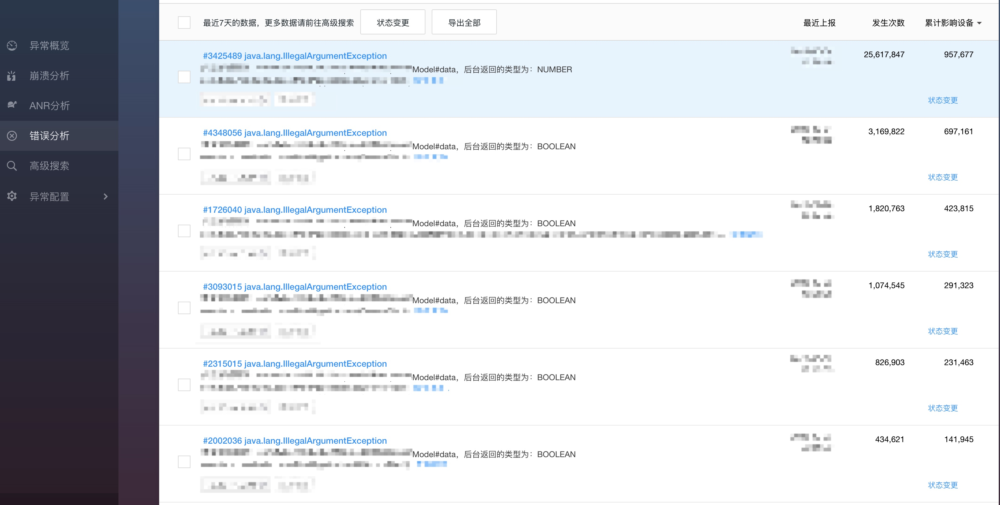

# Gson 解析容错框架

* 项目地址：[Github](https://github.com/getActivity/GsonFactory)

#### 集成步骤

* 如果你的项目 Gradle 配置是在 `7.0 以下`，需要在 `build.gradle` 文件中加入

```groovy
allprojects {
    repositories {
        // JitPack 远程仓库：https://jitpack.io
        maven { url 'https://jitpack.io' }
    }
}
```

* 如果你的 Gradle 配置是 `7.0 及以上`，则需要在 `settings.gradle` 文件中加入

```groovy
dependencyResolutionManagement {
    repositories {
        // JitPack 远程仓库：https://jitpack.io
        maven { url 'https://jitpack.io' }
    }
}
```

* 配置完远程仓库后，在项目 app 模块下的 `build.gradle` 文件中加入远程依赖

```groovy
android {
    // 支持 JDK 1.8
    compileOptions {
        targetCompatibility JavaVersion.VERSION_1_8
        sourceCompatibility JavaVersion.VERSION_1_8
    }
}

dependencies {
    // Gson 解析容错：https://github.com/getActivity/GsonFactory
    implementation 'com.github.getActivity:GsonFactory:6.6'
    // Json 解析框架：https://github.com/google/gson
    implementation 'com.google.code.gson:gson:2.10.1'
}
```

* 需要注意的是：Gson 框架必须使用 **2.9.0** 及以上版本，否则将会出现版本兼容问题

#### 使用文档

* 请使用框架返回的 Gson 对象来代替项目中的 Gson 对象

```java
// 获取单例的 Gson 对象（已处理容错）
Gson gson = GsonFactory.getSingletonGson();
```

* 因为框架中的 Gson 对象已经对解析规则进行了容错处理

#### 其他 API

```java
// 设置自定义的 Gson 对象
GsonFactory.setSingletonGson(Gson gson);

// 创建一个 Gson 构建器（已处理容错）
GsonBuilder gsonBuilder = GsonFactory.newGsonBuilder();

// 注册类型适配器
GsonFactory.registerTypeAdapterFactory(TypeAdapterFactory factory);

// 注册构造函数创建器
GsonFactory.registerInstanceCreator(Type type, InstanceCreator<?> creator);

// 添加反射访问过滤器
GsonFactory.addReflectionAccessFilter(ReflectionAccessFilter filter);

// 设置 Json 解析容错监听
GsonFactory.setJsonCallback(new JsonCallback() {

    @Override
    public void onTypeException(TypeToken<?> typeToken, String fieldName, JsonToken jsonToken) {
        // Log.e("GsonFactory", "类型解析异常：" + typeToken + "#" + fieldName + "，后台返回的类型为：" + jsonToken);
        // 上报到 Bugly 错误列表中
        CrashReport.postCatchedException(new IllegalArgumentException("类型解析异常：" + typeToken + "#" + fieldName + "，后台返回的类型为：" + jsonToken));
    }
});
```

#### 框架混淆规则

* 在混淆规则文件 `proguard-rules.pro` 中加入

```text
-keep class com.hjq.gson.factory.** {*;}
```

#### 数据类型容错介绍

* 目前支持容错的数据类型有：

	* `Bean 类`

	* `数组集合`

	* `Map 集合`

	* `JSONArray`

	* `JSONObject`

	* `String`（字符串）

	* `boolean / Boolean`（布尔值）

	* `int / Integer`（整数，属于数值类）

	* `long / Long`（长整数，属于数值类）

	* `float / Float`（单精度浮点数，属于数值类）

	* `double / Double`（双精度浮点数，属于数值类）

	* `BigDecimal`（精度更高的浮点数，属于数值类）

* **基本涵盖 99.99% 的开发场景**，可以运行 Demo 中的**单元测试**用例来查看效果：

|  数据类型 |        容错的范围           |            数据示例              |
| :-----: | :--------------------: | :-----------------------: |
|  bean  |  集合、字符串、布尔值、数值  |  `[]`、`""`、`false`、`0`  |
|   集合  |  bean、字符串、布尔值、数值 |  `{}`、`""`、`false`、`0`  |
|  字符串 |   bean、集合、布尔值、数值  |  `{}`、`[]`、`false`、`0`  |
|  布尔值 |   bean、集合、字符串、数值  |    `{}`、`[]`、`""`、`0`   |
|   数值  |  bean、集合、字符串、布尔值 |  `{}`、`[]`、`""`、`false` |

* 大家可能觉得 Gson 解析容错没什么，那是因为我们对 Gson 解析失败的场景没有了解过：

	* 惊吓不断：后台有数据时返回 **JsonObject** 类型，没数据返回 `[]`，Gson 会直接抛出异常
	
	* 意想不到：如果客户端定义的是 **boolean** 类型，但是后台返回的是 **0** 或者 **1**，Gson 会直接抛出异常

	* 措手不及：如果客户端定义的是 **int** 或者 **long** 类型，但是后台返回的是 **float** 或者 **double** 类型，Gson 会直接抛出异常

* 以上情况框架已经做了容错处理，具体处理的规则如下：

	* 如果后台返回的类型和客户端定义的类型不匹配，框架就**跳过解析这个字段**，不影响其他字段正常解析

	* 如果客户端定义的是 **boolean** 类型，但是后台返回整数，框架则将**非 0 的数值则赋值为 true，否则为 false**

	* 如果客户端定义的是 **int** 或者 **long** 类型，但后台返回浮点数，框架就对数值进行**直接取整**并赋值给字段

#### 适配 Kotlin 默认值介绍

* issue 地址：[issues/24](https://github.com/getActivity/GsonFactory/issues/24)

* 如果你在 Kotlin 中定义了以下内容的 Bean 类

```
class XxxBean {
    
    val age: Int = 18
}
```

* 大家是不是以为在后台没有返回 age 字段的情况下，age 字段的值会等于 18 ？我帮大家测试过了，不但不会等于 18，并且还会吃系统一记 `NullPointerException`。

* 这是为什么呢？这个问题源于 Gson 解析的机制，我们都知道 Gson 在解析一个 Bean 类的时候，会反射创建一个对象出来，但是大家不知道的是，Gson 会根据 Bean 类的字段名去解析 Json 串中对应的值，然后简单粗暴进行反射赋值，你没有听错，简单粗暴，如果后台没有返回这个 `age` 字段的值，那么 `age` 就会被赋值为空，但是你又在 Kotlin 中声明了 `age` 变量不为空，这个时候塞一个 `null` 值进去，触发 `NullPointerException` 也是在预料之中。

* 框架目前的处理方案是，如果后台没有返回这个字段的值，又或者返回这个值为空，则不会赋值给类的字段，因为 Gson 那样做是不合理的，会导致我在 Kotlin 上面使用 Gson 是有问题，变量不定义成可空，每次用基本数据类型还得去做判空，定义成非空，一用还会触发 `NullPointerException`，前后夹击，腹背受敌。

* 到这里可能会有人发出疑问了，为什么在 Java 上用没事，偏偏在 Kotlin 上用有问题，你能解释一下这个问题，这个问题也很简单，这是因为 Gson 在反射赋值的时候需要满足两个条件，第一个是值不为空，第二个是类型不是基本数据类型，这两个条件同时满足的情况才会进行赋值，而 Java 和 Kotlin 最大的不同是，Kotlin 没有基本数据类型，只有对象，拿短整数举例，Java 用基本数据类型表示则为 `int`，如果用对象类型表示则为 `Integer`，而 Kotlin 只能用对象类型 `Int` 表示，这下知道为什么了吧。

## 常见疑问解答

####  Retrofit 怎么替换 Gson？

```java
Retrofit retrofit = new Retrofit.Builder()
        .addConverterFactory(GsonConverterFactory.create(GsonFactory.getSingletonGson()))
        .build();
```

#### 如何替换项目中已有的原生 Gson ？

```text
// 替换调用
new Gson()
GsonFactory.getSingletonGson()
```

```text
// 替换导包
import com.google.gson.Gson
import com.hjq.gson.factory.GsonFactory
```

```
// 再手动处理一些没有替换成功的
new GsonBuilder()
```

#### 有没有必要处理 Json 解析容错？

* 我觉得非常有必要，因为后台返回的数据结构是什么样我们把控不了，但是有一点是肯定的，我们都不希望它崩，因为一个接口的失败导致整个 App 崩溃退出实属不值得，但是 Gson 很敏感，动不动就崩。

#### 我们后台用的是 Java，有必要处理容错吗？

* 如果你们的后台用的是 PHP，那我十分推荐你使用这个框架，因为 PHP 返回的数据结构很乱，这块经历过的人都懂，说多了都是泪，没经历过的人怎么说都不懂。

* 如果你们的后台用的是 Java，那么可以根据实际情况而定，可用可不用，但是最好用，作为一种兜底方案，这样就能防止后台突然某一天不讲码德，例如我现在的公司的后台全是用 Java 开发的，但是 Bugly 还是有上报关于 Gson 解析的异常，下面是通过 `GsonFactory.setJsonCallback` 采集到的数据，大家可以参考参考：



* 粗略估算了一下，总共上报了三千万多次错误，影响设备数三百多万，看到这里你还相信 Java 开发的后台不会有数据容错的问题么？事在人为，Java 只是一种开发语言，并不能担保不会有数据容错的问题，如果后续真的出现了这种问题，主要分为两种情况：

    * 如果 iOS 没有做数据容错，那么锅是后台的，这点是毫无疑问的，后台想甩也甩不开

    * 如果 iOS 做了数据容错，那么很可能的处理结果是，后台和 Android 两端的人要被拉出去各挨五十大板：

        * CTO：后台有问题，为什么 iOS 没事，就 Android 有事？

        * Android：iOS 那边做了容错，但是 Android 这边没有做。

        * CTO：你们为什么不做？这种兜底机制本来不应该就得有的吗？

        * Android：我们用了 Gson 框架，它的机制本身就是这样的。

        * CTO：我不管你们用了什么框架，在这点上崩溃了就是你们不对，后台返回错误的数据结构你们不解析就好了，你为什么还崩溃？同样的数据结构咋 iOS 就没有事呢？这个责任应该有你们 Android 一份子。

        * Android：。。。。。。（哑巴吃黄连，有苦说不出）

        * CTO 内心 OS：整个后台都是我在管的，出现这种事情，后面可能会吃不了兜着走，现在幸好拉到一个做垫背的来分担一下事故的责任。

        * Ps：以上故事纯属虚构，大家看看就好，切勿太过当真。不过有一点是真的，若不想日后扯皮，最好还是要留一手。

#### 使用了这个框架后，我如何知道出现了 Json 错误，从而保证问题不被掩盖？

* 对于这个问题，解决方案也很简单，使用 `GsonFactory.setJsonCallback` API，如果后台返回了错误的数据结构，在调试模式下，直接抛出异常即可，开发者可以第一时间得知；而到了线上模式，对这个问题进行上报即可，保证不漏掉任何一个问题（可上传到后台或者 Bugly 错误列表中），示例代码如下：

```java
// 设置 Json 解析容错监听
GsonFactory.setJsonCallback(new JsonCallback() {

    @Override
    public void onTypeException(TypeToken<?> typeToken, String fieldName, JsonToken jsonToken) {
        if (BuildConfig.DEBUG) {
            // 直接抛出异常
            throw new IllegalArgumentException("类型解析异常：" + typeToken + "#" + fieldName + "，后台返回的类型为：" + jsonToken);
        } else {
            // 上报到 Bugly 错误列表
            CrashReport.postCatchedException(new IllegalArgumentException("类型解析异常：" + typeToken + "#" + fieldName + "，后台返回的类型为：" + jsonToken));
        }
    }
});
```

#### 作者的其他开源项目

* 安卓技术中台：[AndroidProject](https://github.com/getActivity/AndroidProject)  

* 安卓技术中台 Kt 版：[AndroidProject-Kotlin](https://github.com/getActivity/AndroidProject-Kotlin)  

* 权限框架：[XXPermissions](https://github.com/getActivity/XXPermissions)  

* 吐司框架：[Toaster](https://github.com/getActivity/Toaster)  

* 网络框架：[EasyHttp](https://github.com/getActivity/EasyHttp)  

* 标题栏框架：[TitleBar](https://github.com/getActivity/TitleBar)  

* 悬浮窗框架：[EasyWindow](https://github.com/getActivity/EasyWindow)  

* ShapeView 框架：[ShapeView](https://github.com/getActivity/ShapeView)  

* ShapeDrawable 框架：[ShapeDrawable](https://github.com/getActivity/ShapeDrawable)  

* 语种切换框架：[MultiLanguages](https://github.com/getActivity/MultiLanguages)  

* 日志查看框架：[Logcat](https://github.com/getActivity/Logcat)  

* 嵌套滚动布局框架：[NestedScrollLayout](https://github.com/getActivity/NestedScrollLayout)  

* Android 版本适配：[AndroidVersionAdapter](https://github.com/getActivity/AndroidVersionAdapter)  

* Android 代码规范：[AndroidCodeStandard](https://github.com/getActivity/AndroidCodeStandard)  

* Android 资源大汇总：[AndroidIndex](https://github.com/getActivity/AndroidIndex)  

* Android 开源排行榜：[AndroidGithubBoss](https://github.com/getActivity/AndroidGithubBoss)  

* Studio 精品插件：[StudioPlugins](https://github.com/getActivity/StudioPlugins)  

* 表情包大集合：[EmojiPackage](https://github.com/getActivity/EmojiPackage)  

* AI 资源大汇总：[AiIndex](https://github.com/getActivity/AiIndex)  

* 省市区 Json 数据：[ProvinceJson](https://github.com/getActivity/ProvinceJson)  

* Markdown 语法文档：[MarkdownDoc](https://github.com/getActivity/MarkdownDoc)  

#### 微信公众号：Android轮子哥


#### Android 技术 Q 群：10047167

#### 如果您觉得我的开源库帮你节省了大量的开发时间，请扫描下方的二维码随意打赏，要是能打赏个 10.24 :monkey_face:就太:thumbsup:了。您的支持将鼓励我继续创作:octocat:（[点击查看捐赠列表](https://github.com/getActivity/Donate)）

 

#### 广告区

* 我现在任腾讯云服务器推广大使，大家如果有购买服务器的需求，可以通过下面的链接购买

[](https://curl.qcloud.com/A6cYskvv)

[【腾讯云】云服务器、云数据库、COS、CDN、短信等云产品特惠热卖中](https://curl.qcloud.com/A6cYskvv)

[](https://curl.qcloud.com/up4fQsdn)

[【腾讯云】中小企业福利专场，多款刚需产品，满足企业通用场景需求](https://curl.qcloud.com/up4fQsdn)

## License

```text
Copyright 2020 Huang JinQun

Licensed under the Apache License, Version 2.0 (the "License");
you may not use this file except in compliance with the License.
You may obtain a copy of the License at

   http://www.apache.org/licenses/LICENSE-2.0

Unless required by applicable law or agreed to in writing, software
distributed under the License is distributed on an "AS IS" BASIS,
WITHOUT WARRANTIES OR CONDITIONS OF ANY KIND, either express or implied.
See the License for the specific language governing permissions and
limitations under the License.
```